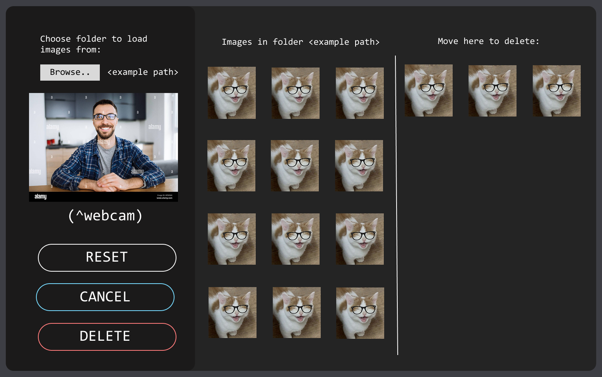
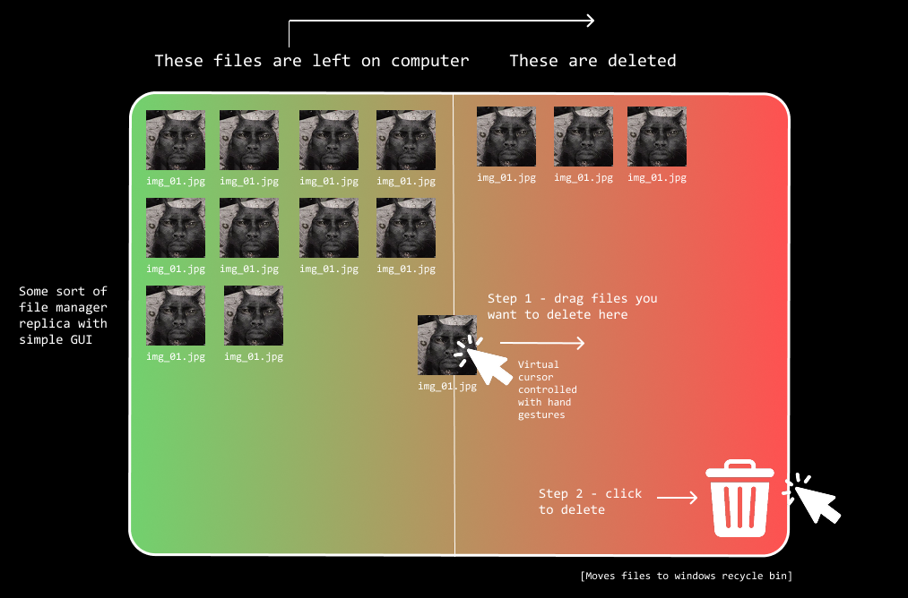

# Gesture-Controlled-Virtual-Files-Sorting-System
# WORK IN PROGRESS 
(like everything i do)

#### IDEA:
**virtual mouse** using opencv + mediapipe for sorting photos / files on computer using only hand gestures
like a tiny program (files manager), with drag and drop (divided view) all photos from a certain folder load on the left, the ones you ‚pick’ and move with ai cursor on the right will get deleted
  (initially) it's supposed to be something like this:
1. a virtual cursor using webcam that opens as a one of the widgets in
2. a GUI window for simple file explorer (using probably custom Tkinter), which loads content from a picked folder on a computer (!! implement some security measures so it doesn't access every folder to avoid accidentally deleting the system, oops + file types restrictions). then using drag and drop functionality, detecting "barriers" between the window's pages so that files that are moved beyond a given range are deleted (safe delete to system's trash collector) by clicking a button (also by using gestures) :) seems simple enough 💪

Planned GUI  |  Original Concept
:-------------------------:|:-------------------------:
 |  

 important resources
- [Tuto for hand tracking](https://www.youtube.com/watch?v=NZde8Xt78Iw)
- [Video capture](https://www.geeksforgeeks.org/python/python-opencv-capture-video-from-camera/)
- [Tuto for virtual cursor](https://www.youtube.com/watch?v=8gPONnGIPgw&list=PLMoSUbG1Q_r8jFS04rot-3NzidnV54Z2q&index=8)
- [Drag and drop](https://youtu.be/uGmMsGOcBB0?si=1xz5jidaO07nkHBX)
- [Managing files in python](https://www.geeksforgeeks.org/python/python-directory-management/)
- [Images in tkinter](https://tkinter.com/images-in-customtkinter-tkinter-customtkinter-17/)
- [Mediapipe docs](https://mediapipe.readthedocs.io/en/latest/solutions/hands.html)
- [Events in tkinter](https://python-course.eu/tkinter/events-and-binds-in-tkinter.php)
- [Webcam in tkinter](https://www.geeksforgeeks.org/python/how-to-show-webcam-in-tkinter-window-python/)
- [Images in tkinter](https://www.w3resource.com/python-exercises/tkinter/python-tkinter-dialogs-and-file-handling-exercise-8.php)

---

(for me)
- keep loaded photos in dictionary (path + label which currently loaded on screen label it is) to know which ones should be deleted after user drags them to certain part of the screen
- ^also some sort of list / also dictionary to mark which photos were left alone (not deleted) in previous load, so they wont load again then user will click 'load more' button 
---
#### todo:
- [ ] implement a virtual cursor with tuto, learn needed frameworks
- [x] find how to optimally integrate these two programs, and if its even possible?
- [x] design a simple GUI in a customtkinter (figma)
- [ ] implement a GUI in a custom tkinker with the code described earlier
- [ ] webcam integration in tkinter
- [ ] implementing protection for certain folders (like root 🙏)
- [ ] add restrictions so that the ai cursor is acccesible only on app window screen so the user wont accidentaly so some action to other programs
- [ ] looots of testing
- [ ] clean this messy structure omg
- [ ] package
